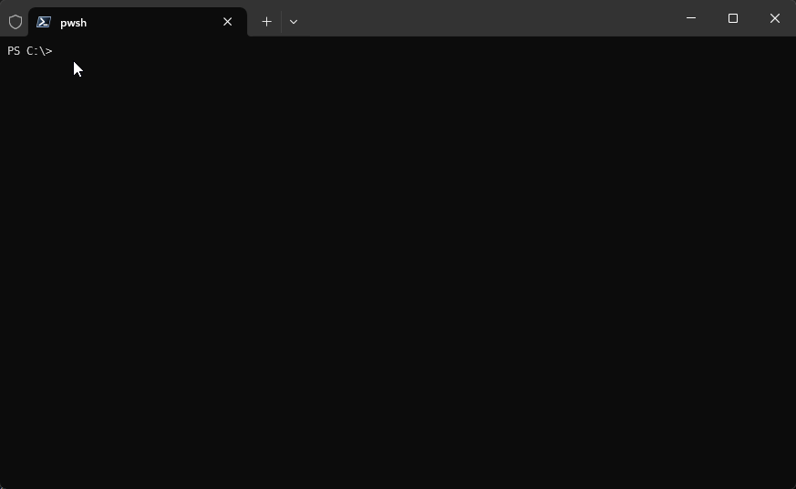
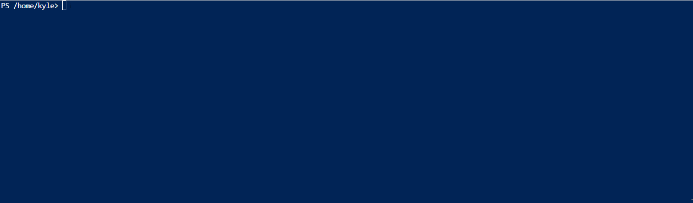



## Overview

This script is part of the Microsoft Well-Architected Reliability Assessment (WARA) engagement. It helps customers validate whether their Azure resources are architected and configured according to Microsoft best practices. The script achieves this by running Azure Resource Graph queries (Kusto/KQL) against Azure subscriptions and resources. Additionally, it collects information about closed support tickets, active Azure Advisor reliability recommendations, past Azure Service Health retirement and outage notifications, and the configuration of Azure Service Health alerts, all of which are relevant for the reliability recommendations provided at the end of the engagement. The collected data is then structured and exported into a JSON file, which is later used as input for the second script, the Data Analyzer script (2_wara_data_analyzer.ps1).


These Azure Resource Graph queries only read ARM (Azure Resource Manager) data. They do not access or collect any keys, secrets, passwords, or other confidential information. The queries only gather information about how resources are deployed and configured. If you would like to learn more, you can explore the Azure Resource Graph Explorer and run some of the query examples provided in the Azure portal.


## Requirements

- [PowerShell 7](https://learn.microsoft.com/en-us/powershell/scripting/install/installing-powershell?view=powershell-7.4)
- [Git](https://git-scm.com/book/en/v2/Getting-Started-Installing-Git)
- [Azure PowerShell modules](https://learn.microsoft.com/en-us/powershell/azure/install-azps-windows?view=azps-12.1.0&tabs=powershell&pivots=windows-psgallery)
  - Az.ResourceGraph
  - Az.Accounts
- Role Based Access Control: Reader role to access to resources to be evaluated

## Quick Start (Cloud Shell or Local Machine)

- We recommend running the script from a *Non-OneDrive* folder.
  - The script block below will handle this for you.
- Download and run the collector script by copying and modifying this script block
- You must replace the TenantID and SubscriptionIds/ResourceGroups to match your tenant and scope resource ids.
- Once the script is downloaded you can execute it by running ./1_wara_collector.ps1

```powershell
#Create new "WARA" directory under C:\ and navigate to C:\WARA. If not Windows then do nothing and move on.
$iswindows ? $(mkdir C:\WARA -ErrorAction SilentlyContinue;cd C:\WARA) : (Write-Host "C:\WARA - Not Required")

#Download the latest version of the script
invoke-webrequest https://aka.ms/aprl/tools/1 -out 1_wara_collector.ps1

#Remove file blocking if active and running windows
$iswindows ? (unblock-file ./1_wara_collector.ps1) : (Write-host "Unblock not required - Not Windows OS")

#Modify these parameters and run the script
./1_wara_collector.ps1 -TenantID "00000000-0000-0000-0000-000000000000" -SubscriptionIds "/subscriptions/00000000-0000-0000-0000-000000000000"
```

### Local Machine



### Cloud Shell



## How to download

- [GitHub Link to Download](https://github.com/Azure/Azure-Proactive-Resiliency-Library-v2/blob/main/tools/1_wara_collector.ps1)

- Download the script using command-line

    ```shell
    iwr https://aka.ms/aprl/tools/1 -out 1_wara_collector.ps1
    ```

- [GitHub Link to Sample Output](https://github.com/Azure/Azure-Proactive-Resiliency-Library-v2/blob/main/tools/sample-output/WARA_File_2024-05-07_11_59.json)

## How to run the script

See at the end of this page various examples of how to run this script - [Examples](#how-to-run-the-1_wara_collectorps1)

**You have two options to run the collector script:**

1. Cloud Shell

1. Local Machine - Requires current modules leveraged in the script be installed

### 1.1 - Cloud Shell

1. From the [Azure Portal](https://portal.azure.com/) open Cloud Shell, select PowerShell instead of BASH
    - If this is your first time using Cloud Shell, refer to the getting started guide from Microsoft Learn - [Azure Cloud Shell](https://learn.microsoft.com/en-us/azure/cloud-shell/get-started/classic?tabs=azurecli#start-cloud-shell).
    

1. Upload the WARA Collector Script to Cloud Shell
    
    Or download the script from GitHub

    ```shell
    iwr https://aka.ms/aprl/tools/1 -out 1_wara_collector.ps1
    ```

1. Execute script leveraging parameters
    - The script accepts both short and/or full paths.
    
    For complex Subscription, ResourceGroups and Tags filtering scenarios we highly recommend using [ConfigFiles - See here an example under config.txt in Example 5](#example-5)

1. Select "A" to allow modules to install
  

1. After Script completes, download the produced json file to your machine
  

1. Read how to execute the [Analyzer Script](../analyzer/_index.md) to generate the Excel report.

### 1.2 Local Machine

1. To run the script there are 5 prerequisites that must be completed first:
    1. **The script must be executed from PowerShell 7. Other versions are not supported, for example: Windows PowerShell and PowerShell ISE**
      
    1. **Git must be installed on the local machine - [Git](https://git-scm.com/download/win)**
    1. **Install required PowerShell Modules:**
        - `Install-Module -Name ImportExcel -Force -SkipPublisherCheck`
        - `Install-Module -Name Az.ResourceGraph -SkipPublisherCheck`
        - `Install-Module -Name Az.Accounts -SkipPublisherCheck`
    1. **Unblock the Script**
        - So at this moment, you need to allow the execution of scripts not signed locally:
          - `Set-ExecutionPolicy -ExecutionPolicy Unrestricted -Scope CurrentUser`
          - `Set-ExecutionPolicy -ExecutionPolicy Unrestricted -Scope LocalMachine`
    1. **Reader permissions to target subscription(s)**

1. Open a new **PowerShell 7 session** after completing prerequisites

1. Change your directory to the same location where you are hosting your WARA Collector script.

    - We recommend running this as close to your `C:\` as path to avoid errors related to file path length. Create a `c:\wara\` folder and save all scripts in this folder.
    

1. Access the folder `c:\wara\` and Execute script leveraging the necessary parameters

    - 

1. Authenticate with the account that has Reader permissions to the target subscription(s)
  

1. After script completes, a json file with all the results will be saved to the same folder location.

1. Read how to execute the [Analyzer Script](../analyzer/_index.md) to generate the Excel report.

## Resource Filtering

The filtering capabilities are designed for targeting specific Azure resources, enabling precise and flexible reliability assessments. The scope of the feature includes functionalities that allow users to define the scope and tags and criteria of their reliability checks using parameters or text files.

### Order of operations

1. Subscriptions
    - Subscription scopes like `-SubscriptionIds "/subscriptions/00000000-0000-0000-0000-000000000000"` or `[subscriptionIds]`

    `/subscriptions/11111111-1111-1111-1111-111111111111` in a configuration file always take explicit precedence over any smaller, more specific scope.

1. Resource Groups
    - These scopes can be used explicitly where you need to grab a resource group from a subscription but not evaluate the whole subscription.

1. Tags
    - When your resources have been explicitly scoped as above - the script will then further refine your results based on the tags provided to the script via parameters or configuration file.

### Filtering Considerations

- If you set a subscription filter for `subscription1` and you also set a resource group filter for `subscription1/resourcegroups/rg-demo1` your results will contain **all** of the resources in `subscription1`
  - This is because we specified `subscription1` and so all of `subscription1` will be evaluated. If we only wanted to evaluate `subscription1/resourcegroups/rg-demo1` then we would include that resource group as a filter and not the full subscription.
- If you set a subscription filter for `subscription2` and a resourcegroup filter for `subscription1/resourcegroups/rg-demo1` you will evaluate all of `subscription2` and only the resource group `rg-demo-1`.
- Setting a subscription filter for `subscription3`, a resource group filter for `subscription1/resourcegroups/rg-demo1`, and a tag filter for `environment=~prod` will return only resources or those in resource groups tagged with `environment=~prod` within subscription3 and `subscription1/resourcegroups/rg-demo1`.

### Tags Filtering

The tag filtering feature can be broken into two distinct types:

- `=~` Equals (non-case sensitive) to define your name/value pair values.
- `!~` Not Equals (non-case sensitive) to define your name/value pair values.

These tags can be further broken down into their `Key:Value` pairs and allow for the following logical operands:

- `||` Or operations, when one or more TagName(s) could be equal to one or more TagValue(s).

This separator to separate name/value pairs.

- `,` to separate name/value pairs.

This allows you to build logical tag filtering:

- The following example shows where the tag name can be `App` or `Application` and the value attributed to these tag names must be `App1` or `App2`. In addition, a new entry acts as an `AND` operator. So the first line must be true, so must the second line where we state that the tag name can be `env` or `environment` and the value can be `prod` or `production`. Only when all of these criteria are met would a resource become included in the output file.

In the configFile.txt the configuration looks like:

```text
[tags]
App||Application=~App1||App2
env||environment=~prod||production
```

In PowerShell command line the configuration looks like:

```powershell
-tags "App||Application=~App1||App2","env||environment=~prod||production""
```

- Our next example will demonstrate how we can filter using a `NOT` operator. This will return all resources in scope, except those that meet the requirements of `app` or `application` not equalling `App3`, `env` or `environment` not equalling `dev` or `qa`.

In the configFile.txt the configuration looks like:

```text
[tags]
App||Application!~App3
env||environment!~dev||qa
```

In PowerShell command line the configuration looks like:

```powershell
-tags "App||Application!~App3","env||environment!~dev||qa""
```

## Runbooks


Runbooks are an advanced feature designed for specific workload-aligned use cases. If you're not sure if you need runbooks, you probably don't. Before diving into runbooks, [try using the filtering feature to see if it meets your needs](#resource-filtering).


Learn more about using runbooks with the WARA collector script in the [runbooks docs](runbooks.md).

## How to run the 1_wara_collector.ps1

### Example 1

The workload is entirely hosted in a single subscription that is not shared with other workloads:

Provide parameters in command line:

```powershell
.\1_wara_collector.ps1 -TenantID "00000000-0000-0000-0000-000000000000" -SubscriptionIds "/subscriptions/00000000-0000-0000-0000-000000000000"
```

Provide parameters via ConfigFile:

```powershell
.\Wara_Collector.ps1 -configFile config.txt
```

config.txt

```text
[tenantId]
00000000-0000-0000-0000-000000000000

[subscriptionIds]
/subscriptions/00000000-0000-0000-0000-000000000000
```

### Example 2

The workload is hosted in two subscriptions (Sub-0 and Sub-5), but the Sub-5 subscription is shared with other workloads. I want to filter it by a single ResourceGroup specifically where the components of my workload are hosted:

Provide parameters in command line:

```powershell
.\1_wara_collector.ps1 -TenantID "00000000-0000-0000-0000-000000000000" -SubscriptionIds "/subscriptions/00000000-0000-0000-0000-000000000000" -ResourceGroups "/subscriptions/55555555-5555-5555-5555-555555555555/resourceGroups/RG-1"
```

Provide parameters via ConfigFile:

```powershell
.\Wara_Collector.ps1 -configFile config.txt
```

config.txt

```text
[tenantId]
00000000-0000-0000-0000-000000000000

[subscriptionIds]
/subscriptions/00000000-0000-0000-0000-000000000000

[resourceGroups]
/subscriptions/55555555-5555-5555-5555-555555555555/resourceGroups/RG-1
```


As you're filtering Sub-5 by ResourceGroup, do not pass Sub-5 in the Subscriptions parameter.


### Example 3

The workload is hosted in three subscriptions (Sub-0, Sub-3, and Sub-5). However, since the Sub-5 subscription is shared with other workloads, I need to filter it not only by a specific Resource Group where the components of my workload are hosted but also by two tags, Criticality and Env, as all my subscriptions are hosting non-production resources as well.

```powershell
.\1_wara_collector.ps1 -TenantID "00000000-0000-0000-0000-000000000000" -SubscriptionIds "/subscriptions/00000000-0000-0000-0000-000000000000","/subscriptions/33333333-3333-3333-3333-333333333333" -ResourceGroups "/subscriptions/55555555-5555-5555-5555-555555555555/resourceGroups/RG-1" -Tags 'Criticality=~High','Env=~Prod'
```

Provide parameters via ConfigFile:

```powershell
.\1_Wara_Collector.ps1 -configFile config.txt
```

config.txt

```text
[tenantid]
00000000-0000-0000-0000-000000000000

[subscriptionIds]
/subscriptions/00000000-0000-0000-0000-000000000000
/subscriptions/33333333-3333-3333-3333-333333333333

[resourceGroups]
/subscriptions/55555555-5555-5555-5555-555555555555/resourceGroups/RG-1

[tags]
Criticality=~High
Env=~Prod
```


NAS you're filtering Sub-5 by ResourceGroup, you do not pass Sub-5 in the Subscriptions parameter. In this scenario, the script will set as scope all resources in Sub-0 and Sub-3, and in Sub5/RG1, as long as they all have both Tags, Criticality and Env equal to the values that I defined, High and Prod. Resource that do meet these requirements will be put in a separate array called  "out-of-scope", you will see a Worksheet in the excel file with this name and all resources not validated by the tool.


### Example 4

The workload is hosted in three subscriptions (Sub-0, Sub-4, and Sub-5). However, since the Sub-4 and Sub-5 subscriptions are shared with other workloads, I need to filter them not only by the Resource Groups where the components of my workload are hosted but also by two tags, Criticality and Env, as all my subscriptions are hosting non-production resources as well.

```powershell
.\1_wara_collector.ps1 -TenantID "00000000-0000-0000-0000-000000000000" -SubscriptionIds "/subscriptions/00000000-0000-0000-0000-000000000000" -ResourceGroups "/subscriptions/55555555-5555-5555-5555-555555555555/resourceGroups/RG-1","
","/subscriptions/44444444-4444-4444-4444-444444444444/resourceGroups/RG-2" -Tags 'Criticality=~High','Env=~Prod'
```

Provide parameters via ConfigFile:

```powershell
.\Wara_Collector.ps1 -configFile config.txt
```

config.txt

```text
[tenantid]
00000000-0000-0000-0000-000000000000

[subscriptionIds]
/subscriptions/00000000-0000-0000-0000-000000000000

[resourceGroups]
/subscriptions/55555555-5555-5555-5555-555555555555/resourceGroups/RG-1
/subscriptions/44444444-4444-4444-4444-444444444444/resourceGroups/RG-2

[tags]
Criticality=~High
Env=~Prod
```


Multiple values do not have to be in the same subscription. You can specify multiple resource groups in unique subscriptions.



In the configuration file, we separate multiple entries for a filter by new lines. Where as, from the command line we would pass multiple subscriptions or resource groups using the "string1","string2" pattern. The configuration file is useful for repeated runs, or numerous filters where it may be difficult to troubleshoot syntax in the command line.


### Example 5

The workload is hosted across three subscriptions (Sub-0, Sub-4, and Sub-5). Since Sub-4 and Sub-5 are shared with other workloads, I need to filter them by specific Resource Groups where my workload components are located, as well as by two sets of tags: 'Criticality' and 'Env' (or 'Environment'). This filtering will ensure that non-production resources, such as QA and DEV environments, are excluded from my assessment.

```powershell
.\1_wara_collector.ps1 -TenantID "00000000-0000-0000-0000-000000000000" -SubscriptionIds "/subscriptions/00000000-0000-0000-0000-000000000000" -ResourceGroups "/subscriptions/55555555-5555-5555-5555-555555555555/resourceGroups/RG-1","
","/subscriptions/44444444-4444-4444-4444-444444444444/resourceGroups/RG-2" -Tags 'Criticality=~High','Env||Environment!~Dev||QA'
```

Provide parameters via ConfigFile:

```powershell
.\Wara_Collector.ps1 -configFile config.txt
```

config.txt

```text
[tenantId]
00000000-0000-0000-0000-000000000000

[subscriptionIds]
/subscriptions/00000000-0000-0000-0000-000000000000

[resourceGroups]
/subscriptions/55555555-5555-5555-5555-555555555555/resourceGroups/RG-1
/subscriptions/44444444-4444-4444-4444-444444444444/resourceGroups/RG-2

[tags]
Criticality=~High
Env||Environment!~Dev||QA
```

### Runbook Example


Learn more about runbooks [here](/Azure-Proactive-Resiliency-Library-v2/tools/collector/runbooks/)


Run a runbook.

```powershell
.\1_wara_collector.ps1 `
  -TenantID "00000000-0000-0000-0000-000000000000" `
  -SubscriptionIds "/subscriptions/00000000-0000-0000-0000-000000000000" `
  -RunbookFile ".\runbook.json"
```

Run a runbook using implicit runbook selectors.

```powershell
.\1_wara_collector.ps1 `
  -TenantID "00000000-0000-0000-0000-000000000000" `
  -SubscriptionIds "/subscriptions/00000000-0000-0000-0000-000000000000" `
  -RunbookFile ".\runbook.json"
  -UseImplicitRunbookSelectors
```


Note that `-SubscriptionIds` are required when using a runbook. Runbooks are not compatible with `-ConfigFile`, `-ResourceGroups`,  `-Tags`, `-SAP`, `-AVS`, `-HPC`, `-AVD` parameters. Specify subscriptions in scope using `-SubscriptionIds` parameter.


## Parameters

When calling the Collector script, you must provide some required parameters. Optional parameters can also be included. See the list below:

- **TenantID**
  - Required
  - Description: Target Tenant where the workload resides
  - Type: String (GUID)
  - Example:
    - `"00000000-0000-0000-0000-000000000000"`
- **SubscriptionIds**
  - Required if ResourceGroups is not provided
  - Description: Specifies Subscription(s) to be included in the analysis.
  - Type: String array
  - Example:
    - `"/subscriptions/00000000-0000-0000-0000-000000000000","/subscriptions/AAAAAAAA-AAAA-AAAA-AAAA-AAAAAAAAAAAA"`
- **ResourceGroups**
  - Required if SubscriptionIds is not provided
  - Description: Specifies Resource Group(s) to be included in the analysis
  - Type: String array
  - Example:
    - `"/subscriptions/YYYYYYYY-YYYY-YYYY-YYYY-YYYYYYYYYYYY/resourceGroups/ResourceGroup1","/subscriptions/YYYYYYYY-YYYY-YYYY-YYYY-YYYYYYYYYYYY/resourceGroups/ResourceGroup2"`
- **Tags**:
  - Optional
  - Type: String array
  - Description: Specifies Tags to be used for filtering the resources.
  - Operators:
    - **=~** for "Equal" (non-case sensitive) to define your name/value pair values.
    - **!~** for "Non Equal" (non-case sensitive) to define your name/value pair values.
    - **||** for "Or" operations, when one or more TagName(s) could be equal to one or more TagValue(s).
    - **,** to separate name/value pairs.
  - Examples:
    - `"TagName=~TagValue"`
    - `"TagName=~TagValue","TagName1=~TagValue1"`
    - `"TagName1||TagName2=~TagValue1"`
    - `"TagName1=~TagValue1||TagValue2"`
    - `"TagName1||TagName2=~TagValue1||TagValue2"`
    - `"Env||Environment=~Production||Prod","App=~Ecommerce"`
      - (Result: Subscriptions or ResourceGroups or Resources must have the Tag `Env` OR `Environment` EQUAL to `Production` OR `Prod`, AND must have the Tag `App` EQUAL to `Ecommerce` or `Ecom` (All non-case sensitive). If the Tag requirement is met at Subscription level, all Resources within the Subscription are included, if met at ResourceGroup level, all ResourceGroups with the Tags and all their resources are included; if only met at the Resource level, then only resources that met the tag requirement are included).
- **ConfigFile**:
  - Required when the following parameters are nor provided via command line: `TenantId`, `SubscriptionIDs`, `ResourceGroups` .
    - **Note**: It can't be used in combination with command line parameters.
  - Description: Alternate option to providing command line parameters. Specifies a file for filtering of Subscription, ResourceGroup, ResourceId, and Tags.
  - Type: String (file name and extension)
  - Example:
    - `-configFile configFileName.txt`
    - See ConfigFile example [here](https://github.com/Azure/Azure-Proactive-Resiliency-Library-v2/blob/main/tools/configfile.example)
- **AzureEnvironment**:
  - Optional
  - Description: Specifies the Azure Environment to used for the analysis: AzureCloud, AzureUSGovernment.
  - Type: String
  - Examples:
    - `-AzureEnvironment AzureCloud`
    - or
    - `AzureUSGovernment`
- **SAP, AVS, AVD, HPC**:
  - Optional
  - Description: Used for specialized workload analysis.
  - Type: Switch
  - Example:
    - `-sap` or `-avs` or `-avd` or `-hpc`
- **Debugging**:
  - Optional
  - Description: Writes Debugging information of the script during the execution.
  - Type: Switch
  - Format/Values:
    - `-debugging`
- **RunbookFile**:
  - Optional
  - Description: Specifies the file with the runbook (selectors & checks) to be used. Only used for a particular specialized workload. The parameters section defines the parameters used by the runbook. These parameters will be automatically merged into selectors and queries at runtime.
  - The selectors section identifies groups of Azure resources that specific checks will be run against. Selectors can be any valid KQL predicate (e.g., `resourceGroup =~ 'rg1'`).
  - The checks section maps resource graph queries (identified by GUIDs) to specific selectors.
  - The query_overrides section enables catalogs of specialized resource graph queries to be included in the review.
  - Type: String (file name and extension)
  - Format/Values:
    - `-RunbookFile runbook.json`
  - **Note**: It can't be used in combination with `-ConfigFile`, `-ResourceGroups`, or `-Tags` parameters. Specify subscriptions in scope using `-SubscriptionIds` parameter.
- **UseImplicitRunbookSelectors**:
  - Optional
  - Description: Enables the use of implicit runbook selectors. When this switch is enabled, each resource graph query will be wrapped in an inner join that filters the results to only include resources that match the selector. This is useful when queries do not include selectors.
  - Type: Switch
  - `-UseImplicitRunbookSelectors`
