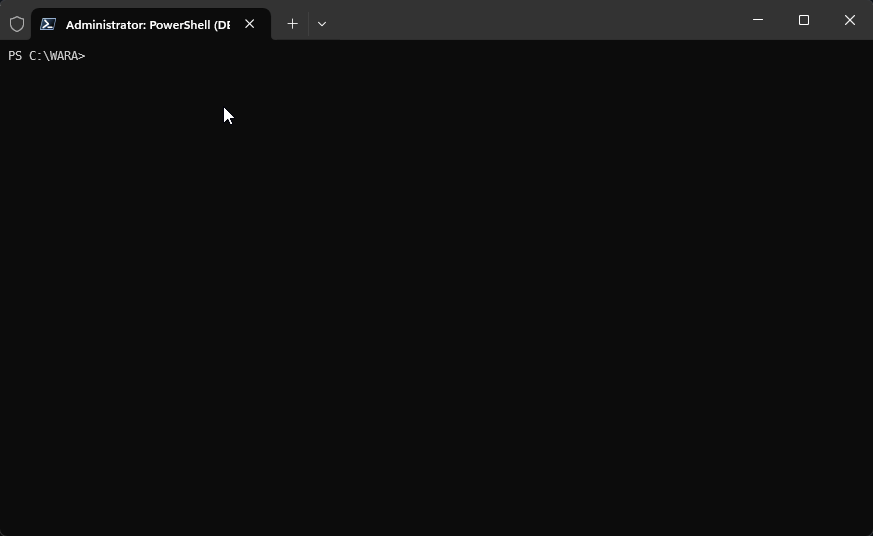



# Well-Architected Reliability Assessment (WARA) Collector Script

## Synopsis
Well-Architected Reliability Assessment (WARA) collector script

## Description
This script is used to collect data from Azure subscriptions to be used in the Well-Architected Reliability Assessment (WARA). The script collects data from the subscriptions, resource groups, and resources, and then runs resource graph queries (Kusto/KQL) to extract information about the resources. The script also collects information about outages, support tickets, advisor recommendations, service retirements, and service health alerts. The collected data is then used to generate a JSON file with recommendations for improving the reliability of the resources. Typically, this JSON file is used as an input for the WARA data analyzer script (2_wara_data_analyzer.ps1).

By default, the script executes all relevant checks in the Azure Proactive Resiliency Library v2 but it can also be configured to run checks against specific groups of resources using a runbook (`-RunbookFile`).

## Requirements
- [PowerShell 7](https://learn.microsoft.com/en-us/powershell/scripting/install/installing-powershell?view=powershell-7.4)
- [Git](https://git-scm.com/book/en/v2/Getting-Started-Installing-Git)
- [Azure PowerShell](https://learn.microsoft.com/en-us/powershell/azure/install-azps-windows?view=azps-12.1.0&tabs=powershell&pivots=windows-psgallery)
  - Az.ResourceGraph
  - Az.Accounts
- Reader access to resources to be evaluated

## Quick Start
- Download and run the collector script by copying and modifying this script block
- You must replace the TenantID and SubscriptionIds/ResourceGroups to match your tenant and scope resource ids.
- Once the script is downloaded you can execute it by running ./1_wara_collector.ps1
```powershell
#Download the latest version of the script
invoke-webrequest https://aka.ms/aprl/tools/1 -out 1_wara_collector.ps1
#Remove file blocking if active and running windows
$iswindows ? (unblock-file ./1_wara_collector.ps1) : (Write-host "Unblock not required - Not Windows OS")
#Modify these parameters and run the script
./1_wara_collector.ps1 -TenantID "00000000-0000-0000-0000-000000000000" -SubscriptionIds "/subscriptions/00000000-0000-0000-0000-000000000000"
```
### Local Machine

### Cloud Shell


- [GitHub Link to Download](https://github.com/Azure/Azure-Proactive-Resiliency-Library-v2/blob/main/tools/1_wara_collector.ps1)
- [GitHub Link to Sample Output](https://github.com/Azure/Azure-Proactive-Resiliency-Library-v2/blob/main/tools/sample-output/WARA_File_2024-05-07_11_59.json)

## Filtering
The filtering capabilities are designed for targeting specific Azure resources, enabling precise and flexible reliability assessments. The scope of the feature includes functionalities that allow users to define the scope and tags and criteria of their reliability checks using parameters or text files.

### Order of operations

1. Subscriptions
   1. Subscription scopes like `-SubscriptionIds "/subscriptions/00000000-0000-0000-0000-000000000000"` or `[subscriptions]
/subscriptions/11111111-1111-1111-1111-111111111111` in a configuration file always take explicit precedence over any smaller, more specific scope.
2. Resource Groups
   1. These scopes can be used explicitly where you need to grab a resource group from a subscription but not evaluate the whole subscription.
3. Tags
   1. When your resources have been explicitly scoped as above - the script will then further refine your results based on the tags provided to the script via parameters or configuration file.

### Filtering Scenarios
- If you set a subscription filter for `subscription1` and you also set a resource group filter for `subscription1/resourcegroups/rg-demo1` your results will contain **all** of the resources in `subscription1`
  - This is because we specified `subscription1` and so all of `subscription1` will be evaluated. If we only wanted to evaluate `subscription1/resourcegroups/rg-demo1` then we would include that resource group as a filter and not the full subscription.
- If you set a subscription filter for `subscription2` and a resourcegroup filter for `subscription1/resourcegroups/rg-demo1` you will evaluate all of `subscription2` and only the resource group `rg-demo-1`.
- Setting a subscription filter for `subscription3`, a resource group filter for `subscription1/resourcegroups/rg-demo1`, and a tag filter for `env==prod` will return **only resources or those in resource groups tagged with env==prod within subscription3 and subscription1/resourcegroups/rg-demo1.**

### Tagging Format
For the WARA script tags are case insensitive.

Tags provided to the WARA script can be broken into two distinct types:
- == Equals
- =/ Not Equals

These tags can be further broken down into their Key:Value pairs and allow for the following logical operands:
- || or

This allows you to build logical tag filtering:
- The following example shows where the tag name can be App or Application and the value attributed to these tag names must be App1 or App2. In addition, a new entry acts as an **AND** operator. So the first line must be true, so must the second line where we state that the tag name can be env or environment and the value can be prod or production. Finally, we say the tag name region must equal the tag value useast. Only when all of these criteria are met would a resource become included in the output file.
```text
[tags]
App||Application==App1||App2
env||environment==prod||production
region==useast
```
In PowerShell this looks like:
```powershell
-tags "App||Application==App1||App2","env||environment==prod||production","region==useast"
```
- Our next example will demonstrate how we can filter using a **NOT** operator. This will return all resources in scope, except those that meet the requirements of app or application not equalling App3, env or environment not equalling dev or qa, and the region not equalling uswest.
```text
[tags]
App||Application=/App3
env|environment=/dev||qa
region=/uswest
```
In PowerShell this looks like:
```powershell
-tags "App||Application=/App3","env|environment=/dev||qa","region=/uswest"
```

# Examples for Well-Architected Reliability Assessment (WARA) Collector Script

## Example 1
Run against one subscriptions in tenant `00000000-0000-0000-0000-000000000000`:
```powershell
.\1_wara_collector.ps1 -TenantID "00000000-0000-0000-0000-000000000000" -SubscriptionIds "/subscriptions/00000000-0000-0000-0000-000000000000"
```
## Example 2
Run against one subscription and one resource group in tenant `00000000-0000-0000-0000-000000000000`:
```powershell
.\1_wara_collector.ps1 -TenantID "00000000-0000-0000-0000-000000000000" -SubscriptionIds "/subscriptions/00000000-0000-0000-0000-000000000000" -ResourceGroups "/subscriptions/55555555-5555-5555-5555-555555555555/resourceGroups/Demo1-RG"
```
## Example 3
Run against two subscriptions and one resource group in tenant using tags to filter resources within the scope of the subscription and resource group in the tenant`00000000-0000-0000-0000-000000000000`:
```powershell
.\1_wara_collector.ps1 -TenantID "00000000-0000-0000-0000-000000000000" -SubscriptionIds "/subscriptions/00000000-0000-0000-0000-000000000000","/subscriptions/33333333-3333-3333-3333-333333333333" -ResourceGroups "/subscriptions/55555555-5555-5555-5555-555555555555/resourceGroups/Demo1-RG" -Tags 'Criticality==High','Env==Prod'
```
## Example 4
Run against one subscription and two resource groups in tenant `00000000-0000-0000-0000-000000000000` using tags to filter resources within the scope of the subscription and resource group in the tenant`00000000-0000-0000-0000-000000000000`:
```powershell
.\1_wara_collector.ps1 -TenantID "00000000-0000-0000-0000-000000000000" -SubscriptionIds "/subscriptions/00000000-0000-0000-0000-000000000000" -ResourceGroups "/subscriptions/55555555-5555-5555-5555-555555555555/resourceGroups/Demo1-RG","/subscriptions/44444444-4444-4444-4444-444444444444/resourceGroups/Demo2-RG" -Tags 'Criticality==High','Env==Prod'
```
**Note**: Multiple values do not have to be in the same subscription. You can specify multiple resource groups in unique subscriptions.
## Example 5
Run a configuration file:
```powershell
.\1_wara_collector.ps1 -ConfigFile ".\config.txt"
```
### ConfigFile Example
```text
[tenantid]
00000000-0000-0000-0000-000000000000

[subscriptions]
/subscriptions/11111111-1111-1111-1111-111111111111

[resourcegroups]
/subscriptions/55555555-5555-5555-5555-555555555555/resourceGroups/Demo1-RG
/subscriptions/22222222-2222-2222-2222-222222222222/resourceGroups/Demo1-RG

[tags]
env==prod
application==demoapp1
```
**Note**: In a configuration file we separate multiple entries for a filter by new lines. Where as, from the command line we would pass multiple subscriptions or resource groups using the "string1","string2" pattern. The configuration file is useful for repeated runs, or numerous filters where it may be difficult to troubleshoot syntax in the command line.

## Parameters

### Debugging
- **Type**: Switch
- **Description**: Enables debugging output.
- *Optional*

### SAP
- **Type**: Switch
- **Description**: Enables recommendations and queries for the SAP specialized workload.
- *Optional*

### AVD
- **Type**: Switch
- **Description**: Enables recommendations and queries for the AVD specialized workload.
- *Optional*

### AVS
- **Type**: Switch
- **Description**: Enables recommendations and queries for the AVS specialized workload.
- *Optional*

### HPC
- **Type**: Switch
- **Description**: Enables recommendations and queries for the HPC specialized workload.
- *Optional*

### SubscriptionIds
- **Type**: String Array
- **Description**: Specifies the subscription IDs to be included in the review. Multiple subscription IDs should be separated by commas. Subscription IDs must be in either GUID form (e.g., `00000000-0000-0000-0000-000000000000`) or full subscription ID form (e.g., `/subscriptions/00000000-0000-0000-0000-000000000000`).
- *Optional*
- **Note**: Can't be used in combination with `-ConfigFile` parameter.

### ResourceGroups
- **Type**: String Array
- **Description**: Specifies the resource groups to be included in the review. Multiple resource groups should be separated by commas. Resource groups must be in full resource group ID form (e.g., `/subscriptions/00000000-0000-0000-0000-000000000000/resourceGroups/rg1`).
- *Optional*
- **Note**: Can't be used in combination with `-ConfigFile` or `-RunbookFile` parameters.

### Tags
- **Type**: String
- **Description**: Specifies the tags to be used to filter resources.
- **Note**: Can't be used in combination with `-ConfigFile` or `-RunbookFile` parameters.
- *Optional*

### TenantID
- **Type**: String
- **Description**: Specifies the Entra tenant ID to be used to authenticate to Azure.
- *Required*

### AzureEnvironment
- **Type**: String
- **Description**: Specifies the Azure environment to be used. Valid values are `AzureCloud` and `AzureUSGovernment`. Default value is `AzureCloud`.
- *Optional*

### ConfigFile
- **Type**: String
- **Description**: Specifies the configuration file to be used.
- *Optional*
- **Note**: Can't be used in combination with `-RunbookFile`, `-SubscriptionIds`, `-ResourceGroups`, or `-Tags` parameters.

### RunbookFile
- **Type**: String
- **Description**: Specifies the runbook file to be used. More information about runbooks:
  - The parameters section defines the parameters used by the runbook. These parameters will be automatically merged into selectors and queries at runtime.
  - The selectors section identifies groups of Azure resources that specific checks will be run against. Selectors can be any valid KQL predicate (e.g., `resourceGroup =~ 'rg1'`).
  - The checks section maps resource graph queries (identified by GUIDs) to specific selectors.
  - The query_overrides section enables catalogs of specialized resource graph queries to be included in the review.
  - *Optional*
- **Note**: Can't be used in combination with `-ConfigFile`, `-ResourceGroups`, or `-Tags` parameters. Specify subscriptions in scope using `-SubscriptionIds` parameter.

### UseImplicitRunbookSelectors
- **Type**: Switch
- **Description**: Enables the use of implicit runbook selectors. When this switch is enabled, each resource graph query will be wrapped in an inner join that filters the results to only include resources that match the selector. This is useful when queries do not include selectors.
- *Optional*
