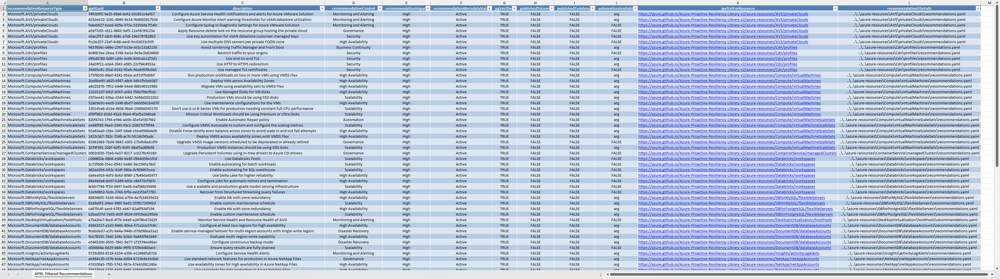

# APRL Recommendations Filtered To Excel Tool (Python)

We realize that sometimes that you may just want a list of the APRL recommendations exported to an Excel workbook, filtered based on the recommendation's impact (High, Medium, Low) and whether it is verified by the Product Group (PG) or not. So we have built a simple python tool to do this for you called: [`aprlRecommendationsFilteredToExcel.py`](aprlRecommendationsFilteredToExcel.py) 👍

*A screenshot of the Excel Workbook output from a run of this script with the default arguments/inputs:*



## Prerequisites

To run this script you'll need python and a few modules installed, the list of requirements is below:

- Python 3.12.3 or newer (will likely work on older versions of python 3.10 and above but was developed and tested on 3.12.3)
- Python Modules:
  - termcolor 1.1.0
  - PyYAML 5.4.1
  - pandas 1.2.4
  - XlsxWriter 1.3.7

You also need a clone/copy of the [APRLv2 repo (this repo)](https://github.com/Azure/Azure-Proactive-Resiliency-Library-v2)

### Installation Script

The below script can be used on Windows to install all the prerequisites using [winget](https://learn.microsoft.com/windows/package-manager/winget/):

```
winget install Python.Python.3.12
python -m pip install -U pip

# Change the below line to be the correct path to your clone/copy of the APRLv2 repo
cd "<path to root of clone of APRLv2 repo (this repo)>\tools\aprlRecommendationsFilteredToExcel"

pip install -r requirements.txt
```

## Running the script

Now you have the prerequisites installed successfully you are ready to run the script and generate your Excel output of the APRL recommendations you want.

This script allows you to filter APRL recommendations based on their impact level and whether they are verified by the Product Group (PG), and then export these filtered recommendations to an Excel file. By default, it filters to only high impact and PG verified recommendations, but you can customize this behavior via the input arguments.

### Arguments

- `--path_to_recommendations`: Specifies the path to the `azure-resources` directory in the APRL repo that you have cloned locally.
  - Type: `str`
  - Default: `../../azure-resources`
  - Example: `--path_to_recommendations "../../azure-resources"`

- `--filter_impact_level`: Allows you to filter the recommendations based on their impact level. You can choose from `High`, `Medium`, `Low`, or `All` to include all levels.
  - Type: `str`
  - Choices: `High`, `Medium`, `Low`, `All`
  - Default: `High`
  - Example: `--filter_impact_level "Medium"`

- `--allow_non_pg_verified`: By default, only PG verified recommendations are exported. Use this flag to include non-PG verified recommendations as well.
  - Action: `store_true`
  - Example: `--allow_non_pg_verified`

- `--output_file_name`: Specifies the name of the output Excel file. The file will be output to the directory from which you are running this script.
  - Type: `str`
  - Default: `aprlFilteredRecommendations.xlsx`
  - Example: `--output_file_name "customFilteredRecommendations.xlsx"`

### Example Commands To Run

#### Defaults

This will output all the High Impact and PG Verified APRL recommendations to a file called: `aprlFilteredRecommendations.xlsx` that will be stored in the current directory where you invoked the script from.

> This assumes you are running the script from its stored location of: `<path to root of clone of APRLv2 repo (this repo)>\tools\aprlRecommendationsFilteredToExcel`

```
python .\aprlFilteredRecommendations.xlsx
```

#### Providing All Different Arguments Values

This will output all of the APRL recommendations, regardless of Impact level (e.g. High, Medium & Low recommendations will be included), it will also include recommendations that have not been verified by a Product Group (PG) yet and will output to a file called: `myCustomAprlFilteredRecommendation.xlsx` that will be stored in the current directory where you invoked the script from. You will also notice that the `--path_to_recommendations` argument has been provided as the script is not being run from its stored location within the APRLv2 repo, so you **must** provide this argument with the path to your clone/copy of the APRLv2 repo and to its `azure-resources` directory within the repo.

```
python .\aprlRecommendationsFilteredToExcel.py --path_to_recommendations "D:\GitRepos\GitHub-Azure\Azure-Proactive-Resiliency-Library-v2\azure-resources\" --filter_impact_level "All" --allow_non_pg_verified --output_file_name "myCustomAprlFilteredRecommendation.xlsx"
```
